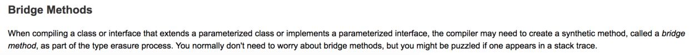
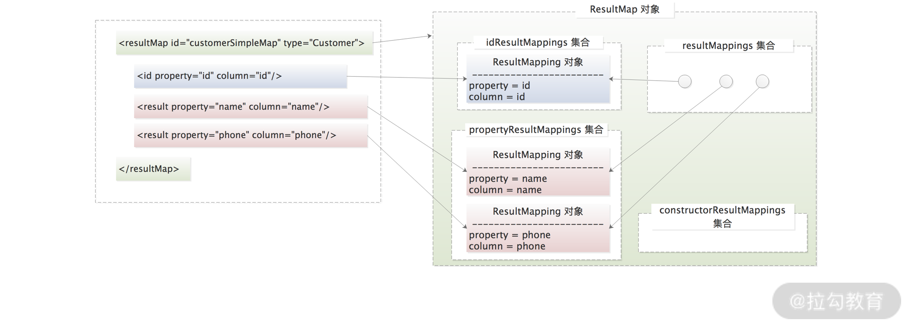

(1) 桥接方法

如果一个类继承了一个泛型类或者实现了一个泛型接口，那么编译器在编译这个类的时候会生成一个混合方法，这个混合方法就叫做**桥接方法**
**这个方法是由编译器生成的，方法上有synthetic**
这个方法的作用是：**泛型类型的安全处理。**

(2) 整个 <resultMap> 标签最终会被解析成 ResultMap 对象，它与 ResultMapping 之间的映射关系如下图所示

(3) mybatis 延迟加载
MyBatis 中的“延迟加载”是指在查询数据库的时候，MyBatis 不会立即将完整的对象加载到服务内存中；
而是在业务逻辑真正需要使用这个对象或使用到对象中某些属性的时候，才真正执行数据库查询操作，将完整的对象加载到内存中。

